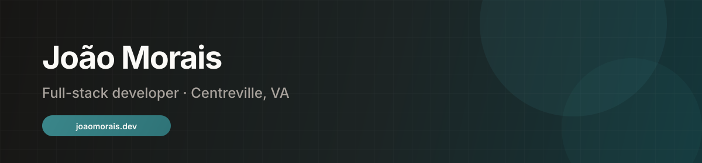

  

 

  

  <a href="https://joaomorais.dev">joaomorais.dev</a>
  ·
  <a href="https://joaomorais.dev/work">case studies</a>
  ·
  <a href="https://github.com/JoaoMorais03?tab=repositories">repos</a>

---

### Day job

**Prozis** — full-stack on a 7-person team owning **5 internal platforms** (~1.3k employees).

Stuff that actually mattered:
- End-to-end ownership (UI → API → data), including one platform reporting to the CEO
- SQL Server → PostgreSQL migration (~40 tables; largest ~500k rows) with Grafana on the hot paths
- Prototyping internal AI tooling around Claude Code

`Vue 3` · `Java` · `Spring Boot` · `PostgreSQL`

---

### Side systems worth reading

| Project | Status | Why it matters |
|---------|--------|----------------|
| **[Tiburcio](https://github.com/JoaoMorais03/Tiburcio)** | public | RAG context layer for Claude Code — Qdrant hybrid search, MCP tools, compact token responses, Docker Compose monorepo |
| **[Claudio Notes](https://github.com/JoaoMorais03/Claudio-Notes)** | public | Learning project: macOS overlay notes in pure Rust + GPUI (Zed's GPU UI framework) — floating window, menu bar, global hotkey, local markdown vault |
| **MoraisEcho** | private | Agent that reviews PRs — grounded feedback on the diff, not generic linter noise |
| **Claudio** | private | ADE for the AI era — native agent CLIs in a PTY, project/agent chrome around them |
| **[Queima25](https://github.com/JoaoMorais03/Queima25)** | public | Offline Swift + SpriteKit iPhone game; shared-device UX, scene-driven, zero backend |
| **[HospitalManagementApp](https://github.com/JoaoMorais03/HospitalManagementApp)** | public | Polyglot services (React / .NET / Node / Prolog) with real boundaries — ISEP LAPR5, team of 4 |
| **[noketa-redesign](https://github.com/JoaoMorais03/noketa-redesign)** | public | Astro landing redesign — typography + restraint, no framework chrome |

---

### Resume highlights

- **joaomorais.dev** — portfolio and CV (Astro + Cloudflare Workers): https://joaomorais.dev
- **Claudio Notes** — https://github.com/JoaoMorais03/Claudio-Notes (Rust, GPUI, learning project)
- Full-stack ownership at Prozis: internal platforms, Postgres migrations, AI tooling

---

### Stack

  

---

  
  

 

  

Private work note

Most Prozis commits never hit this graph. Public signal lives in the repos above and on <a href="https://joaomorais.dev/work">joaomorais.dev/work</a>.

